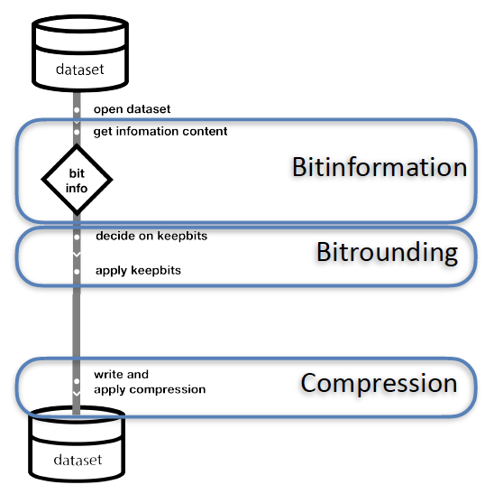

# Summary

Xbitinfo analyses datasets based on their bitwise real information content and applies lossy compression
accordingly. Xbitinfo provides additional tools to visualize the information histograms and to make
informed decisions on the real information threshold that is subsequently used as the preserved precision
during the compression of arrays of floating-point numbers. In contrast, the false information is rounded
to zero using bit rounding. Lossless compression subsequently exploits the high compressibility from trailing
zero mantissa bits. Xbitinfo's functionality supports xarray datasets and therefore a range of common
input and output data formats, and all numcodecs compression algorithms.

# Statement of need

The geosciences, similar to other research fields, are generating more and more data both through
simulations and observations. At the same time, data storage capacity has not kept pace. In addition, data is increasingly stored in the cloud where egress fees and network
speeds are a concern. Compression algorithms can help to reduce the pressure
on these components significantly and are therefore commonly used.

Lossless compressors like Zlib or Zstandard encode datasets exploiting redundancies without losing
any information. This is often unnecessarily conservative as not all the bits are meaningful,
i.e. they do not contain real information. They often encode floating-point numbers with unnecessarily high precision, several orders of magnitude higher than the uncertainty of the data
(arising from, for example, model, numerical, observational or rounding errors) itself. Lossy compression
is therefore often used, sacrificing bits with little to no real information, and from image and
audio compression, JPEG and MP3 are two prominent examples. Geospatial data lacks a similarly
widely accepted compression standard.

JPEG and MP3 use perceptual models of the human visual and auditory system to decide on whether
or not to keep information [@jpeg_iso;@mp3_iso]. Applied to geospatial data, the visual approach is acceptable for the
publication of a scientific figure, however, it may not yield a tolerable compression error for the original
data that still undergoes mathematical operations, like gradients. Commonly used with geospatial
data is linear quantization as it is a standard algorithm supported by the GRIB format. It encodes
the min-max range of the data into evenly, or linearly, spaced quanta and enumerates those using
integers. The issue with linear quantization is however that it often is not a good mapping for
geophysical quantities with a more logarithmic distribution. In practice, the number of preserved
mantissa bits in the quantization process is often applied to an entire set of variables and dimensions.
As a consequence, some variables have too little information preserved while others keep too much
(false) information.

@klower_compressing_2021 have developed an algorithm that can distinguish between real and false
information content based on information theory. It further allows one to set a threshold for the real
information content that shall be preserved if additional compression is needed beyond the
filtering of false information.

As typical for lossy compression, parameters can be set to influence the loss.
In the case of the bit information algorithm, the `inflevel` parameter can be set to decide on the
percentage of real information content to be preserved.
The compression can therefore be split into three main stages:

 - **Bit information**: analysing the bit information content
 - **Bit rounding**:
    - deciding on information content to keep (`inflevel`)
    - translate `inflevel` to mantissa bits to keep (`keepbits`) after rounding
    - bit rounding according to keepbits
 - **Compression**:
    - applying lossless compression

All stages are shown in \autoref{fig:general_workflow}.

{ width=40% }

Bit rounding is supported by many libraries (e.g. CDO, netCDF, numcodecs). One can also set the
`inflevel` and get the corresponding number of keepbits with the Julia implementation provided by
@klower_compressing_2021. However, for a user with a workflow that is otherwise Python-based this
is not convenient. In practice, the decision on how much real information to keep needs
testing with the downstream tools and is often an iterative process to ensure consistent
behaviour with the original dataset. The gathering of the bit information and the decision on
the bit-rounding parameters are therefore often not immediately following each other and are
interrupted by visual inspection and testing (see \autoref{fig:xbitinfo_workflow}).

{ width=40% }

Xbitinfo therefore provides additional convenience functions over  @klower_compressing_2021 to analyse,
filter, and visualize the bitwise real information content. Because Xbitinfo operates on xarray [@xarray] datasets
it can also handle a large variety of input and output formats, such as netCDF [@netcdf] and Zarr [@zarr] and naturally fits
into other scientific workflows. Thanks to the xarray-compatibility, it can also make use of a wide range of
modern lossless compression algorithms that are implemented for specific output data formats, allowing them to exploit the additional compression gains due to reduced information.

Xbitinfo provides two backends for the calculation of the real bitwise information content, one wraps the
latest Julia implementation in BitInformation.jl provided with @klower_compressing_2021 for consistency
and the other uses numpy to be dask compatible and therefore is more performant when compressing in parallel.


# Example

To compress a dataset based on its real bitwise information content with xbitinfo follow these steps:

```python
import xarray as xr
import xbitinfo as xb

ds = xr.open_dataset("/path/to/input/file")
bitinfo = xb.get_bitinformation(ds)
keepbits = xb.get_keepbits(bitinfo, inflevel=0.95)
ds = xb.xr_bitround(ds, keepbits)
ds.to_compressed_zarr("/path/to/output/file")
```


# Remarks

It should be noted that the BitInformation algorithm relies on uncompressed data that hasn't been manipulated beforehand.
A common issue is that climate model output has been linearly quantized during its generation,
e.g. because it has been written to the GRIB format. Such datasets should be handled with care as the bit information often
contains artificial information resulting in too many keepbits. Filters to capture those cases are currently being developed
within xbitinfo to warn the user.

# Acknowledgements

We acknowledge all GitHub contributors that have helped and continue to help to improve Xbitinfo and its dependencies. We also thank
the ECMWF Code4Earth and Google Summer of Code programs for providing funding for students to work on new features of Xbitinfo.
HS was supported in part by the University of Washington eScience Institute and the Cooperative Institute for Climate, Ocean, & Ecosystem Studies (CICOES) under NOAA Cooperative Agreement NA20OAR4320271, Contribution No. 2025-1507

# References
